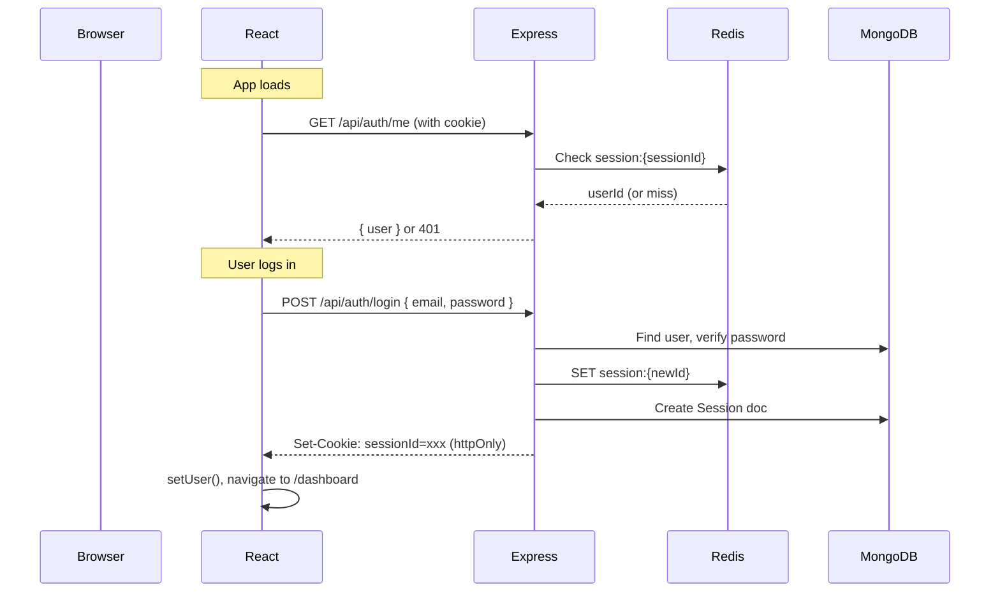

# Frontend ↔ Backend Integration Summary

## Overview
Connected the React frontend with the Express backend using **Axios** and **session-based authentication (cookies)**, with no JWT anywhere.

---

## Backend Changes

### CORS Enabled
- Installed `cors` + `@types/cors`
- Configured in [app.ts](file:///c:/Users/sivaprasad/Desktop/DUS/url_shortner_backend/src/app.ts) with `credentials: true` and origin `http://localhost:5173`

### Port Updated
- Changed from `PORT=3000` → `PORT=5000` in [.env](file:///c:/Users/sivaprasad/Desktop/DUS/url_shortner_backend/.env)
- Added OAuth dummy env vars and `FRONTEND_URL`

### API Routes (Already Existed)
| Method | Route | Auth | Purpose |
|--------|-------|------|---------|
| POST | `/api/auth/register` | ❌ | Register new user |
| POST | `/api/auth/login` | ❌ | Login (creates session cookie) |
| POST | `/api/auth/logout` | ✅ | Destroy session |
| GET | `/api/auth/me` | ✅ | Get current user from session |
| GET | `/api/url` | ✅ | Get all user's URLs |
| POST | `/api/url` | ✅ | Create short URL |
| DELETE | `/api/url/:shortId` | ✅ | Delete URL (ownership verified) |
| GET | `/api/url/:shortId/analytics` | ✅ | Get analytics for a URL |

---

## Frontend Changes

### New Files Created

| File | Purpose |
|------|---------|
| [src/api/axios.ts](file:///c:/Users/sivaprasad/Desktop/DUS/url_shortner_frontend/src/api/axios.ts) | Central Axios instance (`withCredentials: true`) |
| [src/context/AuthContext.tsx](file:///c:/Users/sivaprasad/Desktop/DUS/url_shortner_frontend/src/context/AuthContext.tsx) | Global auth state (login, register, logout, auto-check `/auth/me`) |
| [src/components/ProtectedRoute.tsx](file:///c:/Users/sivaprasad/Desktop/DUS/url_shortner_frontend/src/components/ProtectedRoute.tsx) | Route guard → redirects to `/login` if unauthenticated |

### Modified Files

| File | Changes |
|------|---------|
| [App.tsx](file:///c:/Users/sivaprasad/Desktop/DUS/url_shortner_frontend/src/App.tsx) | Wrapped in [AuthProvider](file:///c:/Users/sivaprasad/Desktop/DUS/url_shortner_frontend/src/context/AuthContext.tsx#24-68), protected dashboard/analytics/shortener routes, added `/analytics/:shortId` route |
| [LoginPage.tsx](file:///c:/Users/sivaprasad/Desktop/DUS/url_shortner_frontend/src/pages/LoginPage.tsx) | Connected login + register forms to backend APIs, error handling, loading states, OAuth redirects |
| [DashboardPage.tsx](file:///c:/Users/sivaprasad/Desktop/DUS/url_shortner_frontend/src/pages/DashboardPage.tsx) | Fetches real URLs from `GET /api/url`, shows stats, chart, table with delete + analytics buttons |
| [ShortenerPage.tsx](file:///c:/Users/sivaprasad/Desktop/DUS/url_shortner_frontend/src/pages/ShortenerPage.tsx) | Creates URLs via `POST /api/url`, shows recent links, copy/delete functionality |
| [AnalyticsPage.tsx](file:///c:/Users/sivaprasad/Desktop/DUS/url_shortner_frontend/src/pages/AnalyticsPage.tsx) | URL selector (if no param), analytics detail view with charts + country/browser/device breakdowns |
| [DashboardSidebar.tsx](file:///c:/Users/sivaprasad/Desktop/DUS/url_shortner_frontend/src/components/dashboard/DashboardSidebar.tsx) | Shows real user name/email, functional logout button |
| [Navbar.tsx](file:///c:/Users/sivaprasad/Desktop/DUS/url_shortner_frontend/src/components/landing/Navbar.tsx) | Auth-aware: shows "Dashboard" if logged in, "Login/Sign Up" if not |

---

## Auth Flow



---

## How to Run

### Backend
```bash
cd url_shortner_backend
npm run dev
# Runs on http://localhost:5000
```

### Frontend
```bash
cd url_shortner_frontend
npm run dev
# Runs on http://localhost:5173
```

> [!IMPORTANT]
> Make sure **Redis** and **MongoDB** are running before starting the backend.

---

## Packages Installed

| Project | Package | Purpose |
|---------|---------|---------|
| Backend | `cors`, `@types/cors` | Cross-origin requests with credentials |
| Frontend | `axios` | HTTP client with `withCredentials` support |
